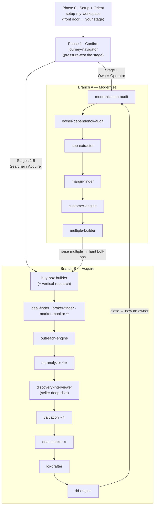

# The Acquisition OS — User Journey (Source of Truth)

This is the canonical map of how a user moves through the Acquisition OS. Every
other surface — the 1-day talk, the lesson track, the build-in-public teasers,
the Skool classroom — is a **view** of this map. Map once, author once, ship
four ways. When the journey changes, change it *here* first.

## The core shape

The journey is **not a straight line.** It forks by *who the user is* (their
stage), and it **loops**: a buyer who closes a deal becomes an owner, modernizes
what they bought, raises the multiple, and hunts again.

There are **two interviews**, at opposite ends — don't conflate them:

- **`setup-my-workspace`** interviews *the buyer* (you) → writes your profile,
  places you in a stage, drafts your buy box, and sets up your Project. This is
  the single front door — the true beginning. `journey-navigator` then *confirms*
  that stage and re-diagnoses when your situation changes.
- **`discovery-interviewer`** interviews *the seller* (50-question deep dive,
  with a role-play simulator to rehearse). This is late-funnel.

And `buy-box-builder` ("deal box") is **not** the start — the front door
diagnoses the person *before* you refine their criteria.

---

## Phase 0 — Setup + Orient *(the single front door)*

| Skill | Does |
|---|---|
| `setup-my-workspace` | **Run first, right after install.** The front door: interviews you, writes `my-profile.md`, **places you in a journey stage**, drafts your buy box, and sets up your Project. Does setup *and* orientation in one sitting. |
| `claude-acquisition-setup` | Creates the Project, loads the buy box as project knowledge, configures the RCTF prompt pattern. |

**Exit criteria:** typing `/` shows the skills; workspace personalized; you know your stage.

## Phase 1 — Confirm *(pressure-test the strategy)*

| Skill | Does |
|---|---|
| `journey-navigator` | **Confirms** the stage `setup-my-workspace` assigned: stress-tests it against the strongest alternative, names the trade-off, and re-diagnoses whenever your situation changes (a close, a sale, new capital). Run after the front door, and again whenever things shift. |

**Exit criteria:** you can say in one sentence which play you're running and why.

**The 5 stages (this is the fork):**

| Stage | You are | The play | Branch |
|---|---|---|---|
| 1. Owner-Operator | Own a business that depends on you | Modernize FIRST — raise the multiple before buying | → Branch A |
| 2. Owner-Acquirer | Own a business that runs; want growth | Hunt bolt-ons | → Branch B |
| 3. First-Time Searcher | No business, limited capital | Start with $0-traffic assets | → Branch B |
| 4. Platform Searcher | Capital + financing ready | Hunt the platform company | → Branch B |
| 5. Roll-Up Operator | Own the platform | Consolidate around the Acquisition Wheel | → Branch B (loop) |

---

## Branch A — Modernize *(Stage 1, and every buyer post-close)*

Raise the multiple of a business you own before buying anything else.

`modernization-audit` → `owner-dependency-audit` → `sop-extractor` →
`margin-finder` → `customer-engine` → `multiple-builder`

| Skill | Does |
|---|---|
| `modernization-audit` | 30-day AI modernization roadmap; ranks quick wins by margin impact vs disruption risk. |
| `owner-dependency-audit` | Inventories every decision, task, relationship that runs through you. |
| `sop-extractor` | Turns one dependency into a documented SOP. |
| `margin-finder` | AI on your P&L; margin lifts ranked by impact vs disruption. |
| `customer-engine` | Modernizes revenue without touching active customer relationships (reviews, reactivation). |
| `multiple-builder` | Tracks the climb from 2.4x owner-operated SDE toward 4.0x professionally-managed EBITDA. |

**Exit criteria:** owner-dependency down, margin up, multiple re-scored higher.

## Branch B — Acquire *(Stages 2–5)*

The linear acquisition funnel. ⭐ marks the strongest build-in-public teasers.

| # | Step | Skill(s) | Teaser |
|---|---|---|---|
| 1 | Define target | `buy-box-builder` (+ `vertical-research` for deep workups) | |
| 2 | Source deals | `deal-finder` · `broker-finder` · `market-monitor` | ⭐ "AI built me a target list" |
| 3 | Reach out | `outreach-engine` | |
| 4 | Qualify (post-contact) | `aq-analyzer` — 13-criterion AQ Score | ⭐⭐ flagship |
| 5 | Seller deep-dive | `discovery-interviewer` — 50 questions | |
| 6 | Value it | `valuation` — SDE/EBITDA, TTM, add-backs | ⭐⭐ "valued in 90 sec" |
| 7 | Structure financing | `deal-stacker` — 216-technique taxonomy | ⭐ "little money down" |
| 8 | Make the offer | `loi-drafter` | |
| 9 | Diligence | `dd-engine` | |

**Exit criteria:** signed LOI, diligence underway, path to close.

---

## The loop

Close a deal → you are now an **owner** → re-enter **Branch A** to modernize
what you bought → raise the multiple → hunt bolt-ons (Stage 5 roll-up) →
Branch B again. **Buy → modernize → buy again.** The two branches are one cycle.

---

## Views of this map

| Surface | View |
|---|---|
| **1-day talk** | Walk the Branch-B spine top to bottom; acknowledge the fork; treat Branch A as "advanced / post-close." |
| **Lesson track** | One lesson per node, in this order. Phase 0 → 1 → Branch B → Branch A. |
| **Teaser sequence** | The ⭐ nodes, *in journey order*, so the build-in-public arc tells a story instead of random demos: target list → AQ score → valuation → financing. |
| **Skool classroom** | Two learning paths = the two branches, joined by the loop. |

## Teaser sequence (build-in-public order)

Run each on a **real** target you're evaluating, capture the session, post the output:

1. `deal-finder` / `vertical-research` — "watch AI find deals in a niche"
2. `aq-analyzer` — "AI scored this real business go/no-go in 4 minutes"
3. `valuation` — "AI valued it in 90 seconds"
4. `deal-stacker` — "how you'd buy it with little down"

Watch which pulls hardest → that node becomes the next full lesson. Demand-driven.

## Giveaways (already built)

- **Deal Advisor free kit** (`advisor/`) — the primary lead magnet.
- **Prompt sampler** — 5–10 pulled from `prompts/vault.md`; full 40+ lives in Skool.

---

## Flow diagram (mermaid source)

